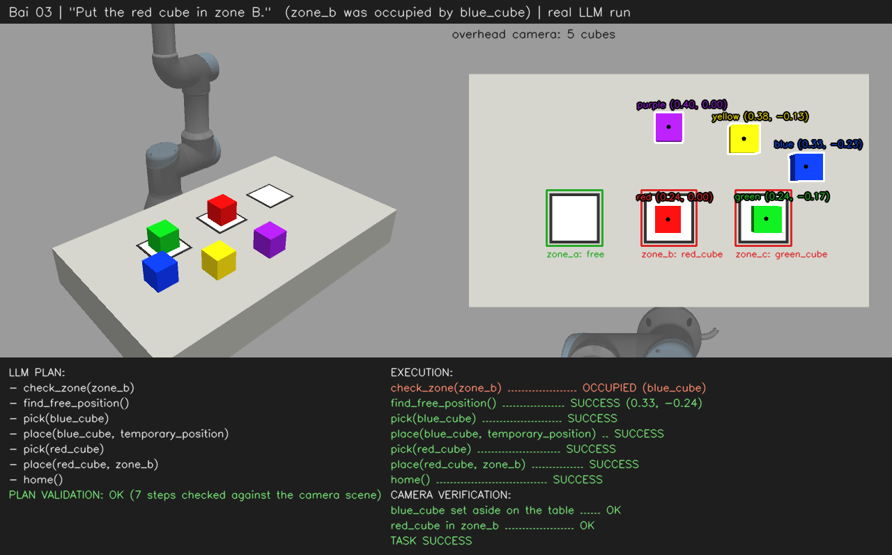

# ur3_llm_control — Bài 03

ROS 2 Humble + Gazebo: a UR3 with a Robotiq 2F-85 gripper and an overhead camera
executes natural-language commands. An LLM (via [9Router](https://github.com/decolua/9router))
plans the skills, a validator checks the plan against what the camera sees, and MoveIt 2
moves the arm. Grasping is physical: object poses are never set directly.

```
Command -> Camera -> LLM Planner -> Plan Validator -> Skills -> MoveIt 2 -> UR3 + 2F-85
```

**Demo:** `zone_b` already holds `blue_cube`. For *"Put the red cube in zone B."* the
robot checks the zone, moves `blue_cube` to a free spot, places `red_cube` in `zone_b`,
returns home, and the camera confirms the result.

## Skills

- `detect_objects()`, `check_zone(zone)`: the camera finds the cubes (OpenCV) and tells
  which zone is free.
- `find_free_position()`: a free spot on the table → `temporary_position`.
- `pick(object)`, `place(object, target)`, `home()`: MoveIt 2 with collision checking
  against the table and the detected cubes.

The LLM only chooses skills, names and order. The validator rejects anything else and
simulates the plan on the camera scene, e.g. no placing into an occupied zone. A
rejected plan goes back to the LLM to be corrected.

## Build & run

```bash
cd ~/ros2_ws/src
git clone https://github.com/Khanhkhan1/ur3_llm_control_bai03.git ur3_llm_control
vcs import . < ur3_llm_control/dependencies.repos
cd ~/ros2_ws && colcon build --symlink-install && source install/setup.bash

export NINEROUTER_API_KEY=<your-key>   # 9router dashboard -> Endpoint & Key
ros2 launch ur3_llm_control llm_robot.launch.py ur_type:=ur3
$(ros2 pkg prefix ur3_llm_control)/lib/ur3_llm_control/run_command.sh "Put the red cube in zone B."
```

## Result

- Video demo: https://drive.google.com/file/d/1iSVjmQDtxVjKtzL9OC7fkzXTYYMzx3cH/view?usp=sharing


